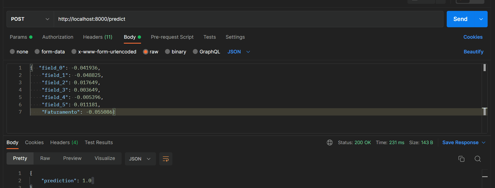

# Documentação da ponderada

## Como executar o projeto
- Para a execução do projeto primeiramente é necessário o usuário realizar um pull na imagem da ponderada que está publicada no docker hub 
<pre><code>
docker pull felipeleao0902/pondearada3
</code></pre>
- Em seguida basta rodar o seguinte comando para iniciar a aplicação
<pre><code>
docker run -d -p 8000:8000 felipeleao0902/pondearada3
</code></pre>
- Por fim, agora sua aplicação já está rodando basta testá-la em qualquer software que teste rotas como o postman por exemplo, deixarei abaixo um gif exemplificando um cenário de teste e o funcionamento da aplicação.

## Documentação do ambiente de desenvolvimento
 - Para o ambiente de desenvolvimento do colab, coloquei  células de texto ao longo do notebook explicando o que eu estava fazendo e porque estava fazendo, além disso o arquivo do colab junto com o arquivo que utilizei para extrair os dados estão na pasta notebook.
## Documentação da API
- Para a documentação da API utilizei grande parte do modelo de api que o prórpio pycaret cria, contudo fiz algumas alterações devido alguns problemas que tive com os valores de entrada e saida do meu modelo.
-Criei duas classses para utilizar como input e outút da minha api, essas classes funcionam basicamente para resolver problemas de formatação dos dados de entrada e saida da API.
<pre><code>
class ApiInput(BaseModel):
    field_0: float
    field_1: float
    field_2: float
    field_3: float
    field_4: float
    field_5: float
    Faturamento: float

class ApiOutput(BaseModel):
    prediction: float
</code></pre>

- Por fim, apenas alterei alguns campos na função de predict que é chamada quando se entra na rota alocada para que utilizasse as minhas classes como input e output do modelo
<pre><code>
@app.post("/predict", response_model=ApiOutput)
def predict(data: ApiInput):
    data = pd.DataFrame([data.dict()])
    predictions = predict_model(model, data=data)
    prediction_value = predictions["prediction_label"].iloc[0]
    
    return {"prediction": prediction_value}

</code></pre>

## Escolha do modelo
- A escolha do modelo foi feita através da utilização do AutoIML para testar o mesmo conjunto de dados em diferentes modelos preditivos pré-prontos da biblioteca do Pycaret, assim após esses teste o modelo escolhi foi o catboost, um modelo de classificação que obteve a maior acurácia de 0.7649.