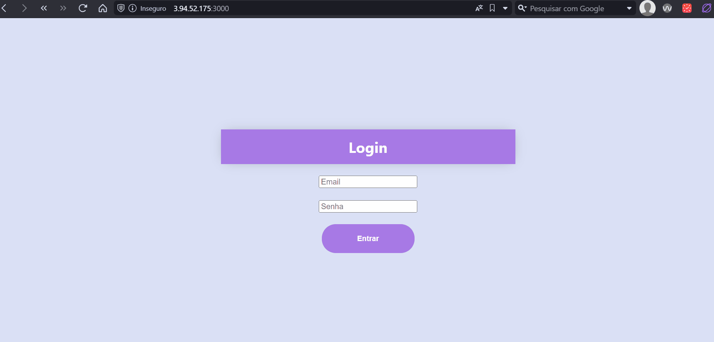

# Atividade ponderada de programação

## Estrutura de pastas 
<pre><code>
ponderada 2.1/
│
├── backend/
│   ├── auth
│   ├── routes/
|   └── venv/
│
├── frontend/
│   ├── src/
│   ├── public/
|   └── node_modules/
└── modelo/
</code></pre> 

## Arquitetura da solução:
- Para a arquitetura dessa solução foi utilizado um [Frontend](#frontend) em React, um [Backend](#backend) em FastAPI e o banco de dados em PostgreSQL.

### Frontend
- Para a construção do frontend foram utilizado algumas bilbiotecas que serão listadas abaixo.

1. Axios, utilizado para realizar a integração através de requisições para o backend 
2. Icons, biblioteca utilizada para baixar icones do próprio framework do react.
3. Router, uma biblioteca utilizada para facilitar a navegação entre páginas através de rotas diretamente do frontend.

Dentro da pasta src está localizado todos os arquivos das paginas sendo eles home.js e login.js, além de conter o arquivo app.css que aplica os estilos nas demais páginas. O Login.js é referente a página de login, já o home.js é referente a página do dashboard.

### Backend
- Para a construção do backend foram utilizado algumas bilbiotecas que serão listadas abaixo.

1. Omar, uma biblioteca que faz o papel de ORM como uma abstração do SQLAchemy que por sua vez ja é uma abstração de banco de dados do tipo SQL.
2. Psycopg, uma biblioteca que posibilita a utilizando do banco de dados postgres.
3. PyJWT, uma biblioteca para a utilização de tokens para a autenticação das rotas. 

Dentro da pasta Routes, estão os arquivos para as rotas de usuário e de startups e na pasta raiz backend estão os arquivos db.py que configura a criação das tabelas pelo sqlAlquemy, models.py, que atua na configuração de como os dados serão armzenados e processados para o banco de dados, main.py que é o arquivo principal para a execução da aplicação. Dentro da pasta auth esta dois arquivos relacionados a autenticação do token sendo eles o  jwt_beare e jwt_header no qual o primeiro é responsável por verificar e autenticar o token, ja o segundo é responsável por criar o token.

## Modelo
 - Para o ambiente de desenvolvimento do colab, coloquei  células de texto ao longo do notebook explicando o que eu estava fazendo e porque estava fazendo, além disso o arquivo do colab junto com o arquivo que utilizei para extrair os dados estão na pasta notebook.
- Para a documentação da API utilizei grande parte do modelo de api que o prórpio pycaret cria, contudo fiz algumas alterações devido alguns problemas que tive com os valores de entrada e saida do meu modelo.
-Criei duas classses para utilizar como input e outút da minha api, essas classes funcionam basicamente para resolver problemas de formatação dos dados de entrada e saida da API.
<pre><code>
class ApiInput(BaseModel):
    field_0: float
    field_1: float
    field_2: float
    field_3: float
    field_4: float
    field_5: float
    Faturamento: float

class ApiOutput(BaseModel):
    prediction: float
</code></pre>

- Por fim, apenas alterei alguns campos na função de predict que é chamada quando se entra na rota alocada para que utilizasse as minhas classes como input e output do modelo
<pre><code>
@app.post("/predict", response_model=ApiOutput)
def predict(data: ApiInput):
    data = pd.DataFrame([data.dict()])
    predictions = predict_model(model, data=data)
    prediction_value = predictions["prediction_label"].iloc[0]
    
    return {"prediction": prediction_value}

</code></pre>

## AWS 

### Criando as instancias 

#### front
Para a configuração do ec2 do frontend utilizei os seguintes códigos 
<pre><code>ssh -i "ponderada.pem" ubuntu@ec2-3-94-52-175.compute-1.amazonaws.com
sudo apt update
sudo apt upgrade
curl -o- https://raw.githubusercontent.com/nvm-sh/nvm/v0.34.0/install.sh | bash
. ~/.nvm/nvm.sh
nvm install node
git clone https://github.com/Leao09/Exercicios-prog-M7.git
cd Exercicio-prog-m7/Ponderada 4/frontend
npm run dev</code></pre> 
ele esta rodando na seguinte url: http://3.94.52.175:3000

## backend
para a configuração do ec2 do backend utilizei os seguintes
<pre><code>ssh -i "ponderada.pem" ubuntu@ec2-3-94-52-175.compute-1.amazonaws.com
sudo apt update
sudo apt upgrade
sudo apt install python3-pip
git clone https://github.com/Leao09/Exercicios-prog-M7.git
cd Exercicio-prog-m7/Ponderada 4/backend
sudo pip3 install -r requirements.txt
python3 -m uvicorn main:app --host 0.0.0.0 --port 8000</code></pre>

ele esta rodando na seguinte url: http://18.204.213.49:8000
### Criação de um rds
Utilizei um banco de dados em postgres e para isso criei um rds com as informações
<pre><code>DB_NAME: postgres
DB_USER: postgres
DB_PASSWORD: admin123
DB_HOST: pond4.clt0opifs3lm.us-east-1.rds.amazonaws.com</code></pre>
### Imagens da rotas 

## API 
para aconfiguração do ec2 do modelo utilizei os seguintes códigos
<pre><code>ssh -i "ponderada.pem" ubuntu@ec2-3-94-52-175.compute-1.amazonaws.com
sudo apt update
sudo apt upgrade
sudo apt install python3-pip
git clone https://github.com/Leao09/Exercicios-prog-M7.git
cd Exercicio-prog-m7/Ponderada 4/modelo
sudo pip3 install -r requirements.txt
python3 Api.py</code></pre>
dessa forma ela está rodando na seguinte url:http://44.215.236.172:8001
### Imagens da rotas

### Configuração do grupo de segurança 
Para criação do grupo de segurança de cada ec2 eu apenas criei uma regra de entrada com protocolo TCP personalizad tipo TCP porta repectiva do ec2 (front 3000,back 8000, api 8001) para aceitar acessos de qualquer origem 0.0.0.0
### versão final 

# Como rodar a aplicação
Para rodar a aplicação basta utilizar os seguintes comando em um arquivo Docker-compose.yml
<pre><code>
version: "3.8"

services:
  db:
    image: postgres:15-alpine
    volumes:
      - postgres_data:/var/lib/postgresql/data/
    expose:
      - 5432
    environment:
      POSTGRES_DB: postgres
      POSTGRES_USER: postgres
      POSTGRES_PASSWORD: postgres

modelo:
    image: felipeleao0902/pondearada3
    build:
      context: ./api
    ports:
      - "8001:8001"

  server:
    image: felipeleao0902/ponderada4-back
    command: bash -c 'uvicorn app.main:app --host 0.0.0.0'
    ports:
      - "8000:8000"
    environment:
      - DATABASE_URL=postgresql://postgres:postgres@db:5432/postgres
    depends_on:
      - db

  frontend:
    image: felipeleao0902/ponderada4-front
    ports:
      - "3000:3000"

volumes:
  postgres_data:
</code></pre>
E por fim rodar o seguinte comando 
 <pre><code>
    docker compose up -d --build
 </code></pre>